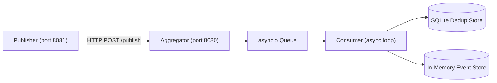

# Pub-Sub Log Aggregator

**Nama**: Rizky Irswanda Ramadhana  
**NIM**: 11231089

Sistem log aggregator berbasis Publish-Subscribe dengan idempotent consumer dan deduplication menggunakan Docker Compose.

---

## Arsitektur



Dua service berjalan dalam satu Docker Compose network (`pubsub-net`):

| Service | Port | Fungsi |
|---------|------|--------|
| `aggregator` | 8080 | Terima, deduplikasi, dan simpan event |
| `publisher` | 8081 | Generate dan kirim event (simulasi at-least-once) |

---

## Cara Build & Run

### Prasyarat
- Docker >= 24
- Docker Compose >= 2.20

### Menjalankan dengan Docker Compose

```bash
docker compose up --build
```

### Menjalankan hanya aggregator

```bash
docker build -t uts-aggregator ./aggregator
docker run -p 8080:8080 -v $(pwd)/data:/app/data uts-aggregator
```

---

## Simulasi Publish (at-least-once)

Setelah semua service berjalan, trigger publisher untuk mengirim 6.000 event dengan 25% duplikat:

```bash
curl -X POST http://localhost:8081/run
```

Cek status publisher:

```bash
curl http://localhost:8081/status
```

---

## Endpoint Aggregator

### `POST /publish`
Terima satu atau banyak event sekaligus (batch).

```bash
curl -X POST http://localhost:8080/publish \
  -H "Content-Type: application/json" \
  -d '{
    "events": [
      {
        "topic": "logs.auth",
        "event_id": "550e8400-e29b-41d4-a716-446655440000",
        "timestamp": "2026-04-24T10:00:00+00:00",
        "source": "service-auth",
        "payload": {"level": "INFO", "message": "User logged in"}
      }
    ]
  }'
```

**Response:**
```json
{"queued": 1}
```

---

### `GET /events?topic=<topic>`
Kembalikan semua event unik yang sudah diproses untuk topic tertentu.

```bash
curl "http://localhost:8080/events?topic=logs.auth"
```

**Response:**
```json
{
  "topic": "logs.auth",
  "count": 42,
  "events": [...]
}
```

---

### `GET /stats`
Kembalikan statistik aggregator.

```bash
curl http://localhost:8080/stats
```

**Response:**
```json
{
  "received": 7500,
  "unique_processed": 6000,
  "duplicate_dropped": 1500,
  "topics": ["logs.auth", "logs.payment", "logs.order"],
  "uptime_seconds": 42.5
}
```

---

## Model Event

| Field | Tipe | Keterangan |
|-------|------|------------|
| `topic` | string | Nama topic, e.g. `logs.auth` |
| `event_id` | string | UUID unik per event |
| `timestamp` | ISO8601 | Waktu event dibuat |
| `source` | string | Nama service pengirim |
| `payload` | object | Data arbitrary JSON |

---

## Menjalankan Unit Tests

```bash
pip install fastapi uvicorn pydantic httpx pytest pytest-asyncio
python -m pytest tests/ -v
```

**9 test cases:**

| # | Test | Cakupan |
|---|------|---------|
| 1 | `test_publish_single_event` | Publish 1 event → 202 |
| 2 | `test_dedup_duplicate_dropped` | Duplikat hanya diproses sekali |
| 3 | `test_batch_publish` | Batch event sekaligus |
| 4 | `test_schema_validation_missing_field` | Field wajib hilang → 422 |
| 5 | `test_schema_validation_invalid_timestamp` | Timestamp invalid → 422 |
| 6 | `test_get_events_by_topic` | GET /events konsisten per topic |
| 7 | `test_stats_consistency` | received = unique + duplicate |
| 8 | `test_dedup_persistence` | SQLite persisten setelah reload |
| 9 | `test_stress_batch_performance` | 5000 event dalam batas waktu |

---

## Variabel Lingkungan

### Aggregator

| Variabel | Default | Keterangan |
|----------|---------|------------|
| `DEDUP_DB_PATH` | `/app/data/dedup.db` | Path SQLite dedup store |
| `PORT` | `8080` | Port server |

### Publisher

| Variabel | Default | Keterangan |
|----------|---------|------------|
| `AGGREGATOR_URL` | `http://localhost:8080` | URL aggregator |
| `EVENT_COUNT` | `6000` | Total event yang dikirim |
| `DUPLICATE_RATE` | `0.25` | Persentase duplikat (0.0–1.0) |
| `BATCH_SIZE` | `100` | Jumlah event per request |
| `PORT` | `8081` | Port server publisher |

---

## Asumsi Desain

1. **Idempotency key**: kombinasi `(topic, event_id)` — event dengan topic berbeda tapi `event_id` sama dianggap dua event berbeda.
2. **At-least-once simulation**: publisher sengaja mengirim ulang subset event untuk mensimulasikan network retry.
3. **Event store in-memory**: event yang sudah diproses disimpan di memori (hilang saat restart), sedangkan dedup store di SQLite tetap persisten.
4. **Ordering**: tidak dijamin total ordering — hanya per-topic ordering dalam consumer loop yang berjalan single-goroutine.
5. **Tidak ada layanan eksternal**: semua berjalan lokal dalam Docker Compose network tanpa koneksi ke internet.
