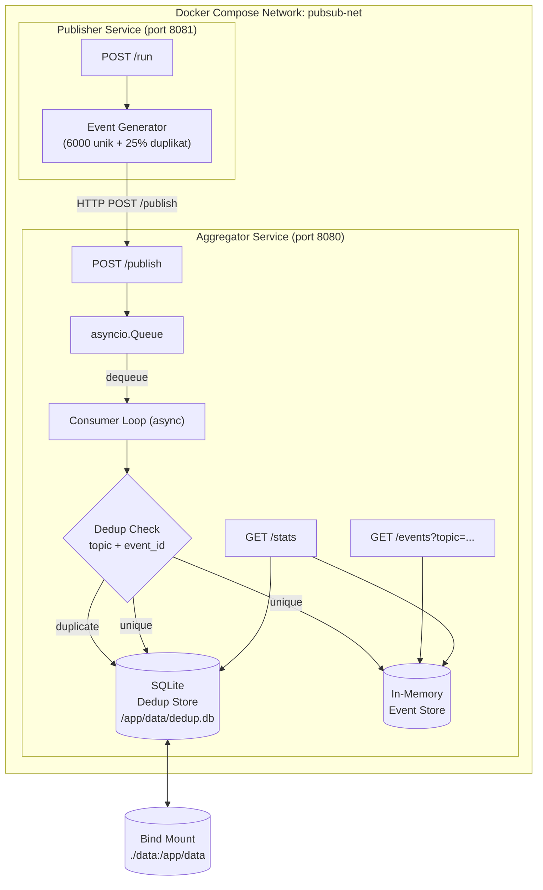
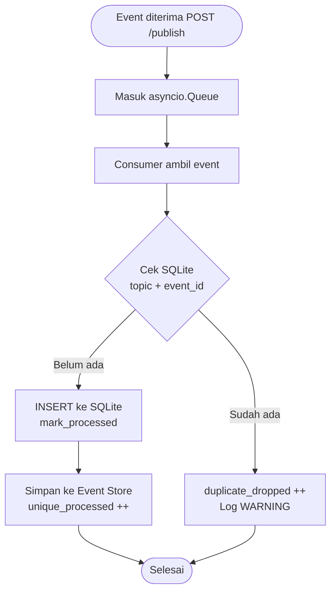

# Laporan: Pub-Sub Log Aggregator dengan Idempotent Consumer dan Deduplication

**Nama**: Rizky Irswanda Ramadhana  
**NIM**: 11231089  
**Mata Kuliah**: Sistem Terdistribusi

**Repository GitHub**: https://github.com/NotHydra/pub-sub-log-aggregator-with-idempotent-consumer-and-deduplication  
**Video Demo YouTube**: https://youtu.be/hcLAhshq-rU

---

## Daftar Isi

1. [T1 — Karakteristik Sistem Terdistribusi & Trade-off Pub-Sub](#t1)
2. [T2 — Arsitektur Client-Server vs Pub-Sub](#t2)
3. [T3 — At-least-once vs Exactly-once Delivery; Idempotency](#t3)
4. [T4 — Skema Penamaan Topic dan Event ID](#t4)
5. [T5 — Ordering: Kapan Total Ordering Tidak Diperlukan](#t5)
6. [T6 — Failure Modes dan Mitigasi](#t6)
7. [T7 — Eventual Consistency melalui Idempotency dan Deduplication](#t7)
8. [T8 — Metrik Evaluasi Sistem](#t8)
9. [Desain Implementasi dan Kaitan Bab 1–7](#desain)
10. [Daftar Pustaka](#referensi)

---

## T1 — Karakteristik Sistem Terdistribusi & Trade-off Pub-Sub {#t1}

Sistem terdistribusi didefinisikan oleh Tanenbaum dan Van Steen (2007) sebagai _"a collection of independent computers that appears to its users as a single coherent system"_ (hal. 2). Definisi ini mengandung dua aspek penting: komponen-komponen yang bersifat otonom, dan tampilan tunggal yang koheren bagi pengguna. Tujuan utama sebuah sistem terdistribusi mencakup aksesibilitas sumber daya, transparansi distribusi, keterbukaan (_openness_), dan skalabilitas (Tanenbaum & Van Steen, 2007, hal. 3).

Dalam konteks sistem Pub-Sub, karakteristik ini menghadirkan serangkaian _trade-off_. Pertama, transparansi distribusi menuntut bahwa publisher tidak perlu mengetahui identitas subscriber, namun hal ini mempersulit pelacakan apakah sebuah event benar-benar diterima. Kedua, skalabilitas menjadi keunggulan Pub-Sub karena penambahan subscriber tidak memerlukan perubahan pada publisher. Namun, skalabilitas ini mengorbankan kontrol aliran: publisher tidak dapat memastikan berapa kali sebuah event diproses oleh setiap subscriber.

Pada implementasi Log Aggregator ini, karakteristik tersebut diwujudkan melalui `asyncio.Queue` sebagai pipeline internal, di mana publisher mengirim event tanpa mengetahui kondisi consumer. Trade-off yang dipilih adalah _at-least-once delivery_ — event mungkin terkirim lebih dari sekali demi menjamin tidak ada event yang hilang — dengan konsekuensi adanya duplikat yang harus ditangani oleh mekanisme deduplication.

> Tanenbaum, A. S., & Van Steen, M. (2007). _Distributed systems: Principles and paradigms_ (Ed. ke-2). Pearson Prentice Hall.

---

## T2 — Arsitektur Client-Server vs Pub-Sub {#t2}

Tanenbaum dan Van Steen (2007) mengidentifikasi empat gaya arsitektur utama dalam sistem terdistribusi: _layered_, _object-based_, _data-centered_, dan _event-based_ (hal. 34). Arsitektur client-server termasuk dalam kategori _centralized architectures_, di mana _"thinking in terms of clients that request services from servers helps us understand and manage the complexity of distributed systems"_ (hal. 36). Dalam model ini, komunikasi bersifat sinkron dan tightly coupled: client menunggu respons dari server sebelum melanjutkan eksekusi.

Sebaliknya, arsitektur Pub-Sub termasuk dalam _event-based architectures_. Prinsip dasarnya adalah bahwa _"processes publish events after which the middleware ensures that only those processes that subscribed to those events will receive them"_ (Tanenbaum & Van Steen, 2007, hal. 35). Keunggulan utamanya adalah _loose coupling_: _"The main advantage of event-based systems is that processes are loosely coupled. In principle, they need not explicitly refer to each other"_ (hal. 35). Proses-proses terdekopel secara ruang (_referential decoupling_) maupun waktu (_temporal decoupling_).

Pada sistem ini, publisher dan aggregator berjalan sebagai container terpisah dalam Docker Compose. Publisher mengirim event melalui HTTP ke endpoint `/publish` tanpa menunggu hasil pemrosesan. Ini mencerminkan prinsip _loose coupling_ Pub-Sub: publisher tidak perlu mengetahui apakah consumer sedang aktif. Di dalam aggregator, `asyncio.Queue` berperan sebagai _event bus_ internal yang memisahkan penerimaan HTTP dari proses deduplication.

> Tanenbaum, A. S., & Van Steen, M. (2007). _Distributed systems: Principles and paradigms_ (Ed. ke-2). Pearson Prentice Hall.

---

## T3 — At-least-once vs Exactly-once Delivery; Idempotency {#t3}

Dalam sistem terdistribusi, terdapat tiga semantik pengiriman pesan terkait kegagalan server. Tanenbaum dan Van Steen (2007) menjelaskan bahwa _at-least-once semantics_ menjamin bahwa operasi _"has been carried out at least one time, but possibly more"_, sementara _at-most-once semantics_ menjamin operasi _"has been carried out at most one time, but possibly none at all"_ (hal. 339). Semantik ketiga yang ideal adalah _exactly-once_, namun _"in general, there is no way to arrange this"_ (hal. 339).

Konsep idempotency menjadi kunci dalam menangani _at-least-once delivery_. Tanenbaum dan Van Steen (2007) mendefinisikan operasi idempoten sebagai operasi yang _"can be executed as often as necessary without any harm being done"_ (hal. 341). Solusi praktisnya adalah dengan menggunakan sequence number: _"By having the server keep track of the most recently received sequence number from each client that is using it, the server can tell the difference between an original request and a retransmission and can refuse to carry out any request a second time"_ (hal. 341). Prinsip inilah yang mendasari mekanisme deduplication.

Dalam implementasi ini, publisher sengaja mengirim ulang 25% event untuk menyimulasikan _at-least-once delivery_. Consumer pada aggregator memeriksa pasangan `(topic, event_id)` di SQLite sebelum memproses setiap event. Jika sudah ada, event dibuang (_duplicate dropped_); jika belum, event diproses dan dicatat. Ini mewujudkan idempotency: operasi yang sama dapat dikirim berkali-kali namun hanya dieksekusi satu kali.

> Tanenbaum, A. S., & Van Steen, M. (2007). _Distributed systems: Principles and paradigms_ (Ed. ke-2). Pearson Prentice Hall.

---

## T4 — Skema Penamaan Topic dan Event ID {#t4}

Penamaan merupakan komponen fundamental dalam sistem terdistribusi. Tanenbaum dan Van Steen (2007) membedakan tiga jenis nama: _address_ (titik akses entitas), _identifier_ (nama unik permanen), dan _human-friendly names_ (hal. 180). Sebuah _true identifier_ memiliki tiga sifat kunci: _(1) an identifier refers to at most one entity; (2) each entity is referred to by at most one identifier; (3) an identifier always refers to the same entity (i.e., it is never reused)_ (hal. 181). Sifat-sifat ini menjadikan identifier sebagai instrumen yang tepat untuk keperluan deduplication.

Dalam sistem Log Aggregator ini, skema penamaan dirancang dengan dua komponen terpisah. Pertama, **topic** berfungsi sebagai nama terstruktur yang mengkategorikan event berdasarkan domain layanan (misalnya `logs.auth`, `logs.payment`). Topic mengikuti pola hierarkis seperti yang dibahas dalam _structured naming_ (Tanenbaum & Van Steen, 2007, hal. 195), memungkinkan routing dan filtering yang efisien. Kedua, **event_id** berupa UUID v4 yang berfungsi sebagai _true identifier_ — unik secara global, tidak dapat digunakan ulang, dan merujuk tepat pada satu event.

Kunci deduplication menggunakan kombinasi `(topic, event_id)`, bukan hanya `event_id` saja. Keputusan ini didasarkan pada pertimbangan bahwa dua layanan berbeda secara teori dapat menghasilkan `event_id` yang sama (meskipun sangat tidak mungkin dengan UUID v4). Dengan menyertakan `topic` sebagai bagian kunci, sistem memastikan isolasi deduplication antar-domain tanpa risiko false positive.

> Tanenbaum, A. S., & Van Steen, M. (2007). _Distributed systems: Principles and paradigms_ (Ed. ke-2). Pearson Prentice Hall.

---

## T5 — Ordering: Kapan Total Ordering Tidak Diperlukan {#t5}

Tanenbaum dan Van Steen (2007) menjelaskan melalui Lamport's logical clocks bahwa _"what usually matters is not that all processes agree on exactly what time it is, but rather that they agree on the order in which events occur"_ (hal. 244). Total ordering — yakni kondisi di mana semua pesan diterima dalam urutan yang sama oleh semua node — adalah properti yang mahal. Tanenbaum dan Van Steen (2007) menyebut ini sebagai _totally-ordered multicast_: _"a multicast operation by which all messages are delivered in the same order to each receiver"_ (hal. 248), yang membutuhkan koordinasi global menggunakan Lamport timestamp.

Total ordering menjadi **tidak diperlukan** ketika operasi bersifat _commutative_ (urutan eksekusi tidak mempengaruhi hasil akhir) atau ketika setiap event bersifat independen dan tidak ada dependensi antar-event. Dalam konteks log aggregation, setiap log entry adalah independen: mencatat `event_id=A` sebelum atau sesudah `event_id=B` tidak mengubah kebenaran isi log. Yang penting adalah setiap event diproses tepat satu kali, bukan urutan globalnya.

Dalam implementasi ini, `asyncio.Queue` memproses event secara FIFO dalam satu _consumer loop_, yang memberikan _per-queue ordering_ secara implisit. Namun, tidak ada jaminan total ordering lintas topic atau lintas batch. Keputusan ini disengaja: karena log entry bersifat idempoten dan independen, biaya koordinasi untuk total ordering tidak sebanding dengan manfaatnya. Throughput yang tinggi (≥5.000 event) dapat dicapai justru karena ordering global tidak diimplementasikan.

> Tanenbaum, A. S., & Van Steen, M. (2007). _Distributed systems: Principles and paradigms_ (Ed. ke-2). Pearson Prentice Hall.

---

## T6 — Failure Modes dan Mitigasi {#t6}

Tanenbaum dan Van Steen (2007) mengklasifikasikan kegagalan dalam sistem terdistribusi ke dalam lima kategori: _crash failure_ (server berhenti mendadak), _omission failure_ (server gagal merespons), _timing failure_ (respons di luar interval waktu), _response failure_ (respons salah), dan _arbitrary failure_ atau Byzantine failure (respons tidak terduga) (hal. 324, Gambar 8-1). Karakteristik unik sistem terdistribusi adalah _partial failure_: _"A partial failure may happen when one component in a distributed system fails. This failure may affect the proper operation of other components, while at the same time leaving yet other components totally unaffected"_ (hal. 321).

Kunci mitigasi kegagalan adalah **redundansi**. Tanenbaum dan Van Steen (2007) mengidentifikasi tiga jenis: _information redundancy_ (bit ekstra untuk koreksi kesalahan), _time redundancy_ (mengulang operasi yang gagal — dasar dari retry), dan _physical redundancy_ (replikasi proses/hardware) (hal. 326). Untuk _lost request messages_, solusinya adalah timer dengan retransmisi: _"just have the operating system or client stub start a timer when sending the request. If the timer expires... the message is sent again"_ (hal. 338).

Dalam implementasi ini, beberapa mitigasi diterapkan. Pertama, publisher menggunakan `httpx` dengan timeout 30 detik untuk mendeteksi omission failure. Kedua, dedup store berbasis SQLite dengan `WAL mode` memastikan atomic write, sehingga crash di tengah penulisan tidak menghasilkan data korup. Ketiga, Docker Compose menggunakan `restart: unless-stopped` sebagai physical redundancy tingkat container. Keempat, healthcheck memastikan publisher hanya mengirim event setelah aggregator benar-benar siap, mencegah _lost request_ pada startup.

> Tanenbaum, A. S., & Van Steen, M. (2007). _Distributed systems: Principles and paradigms_ (Ed. ke-2). Pearson Prentice Hall.

---

## T7 — Eventual Consistency melalui Idempotency dan Deduplication {#t7}

Tanenbaum dan Van Steen (2007) mendefinisikan _eventual consistency_ sebagai model konsistensi di mana _"data stores that are eventually consistent have the property that in the absence of updates, all replicas converge toward identical copies of each other"_ (hal. 289). Syarat minimalnya adalah: _"Eventual consistency essentially requires only that updates are guaranteed to propagate to all replicas"_ (hal. 289). Berbeda dengan _strong consistency_ yang membutuhkan sinkronisasi global yang mahal, _eventual consistency_ melepaskan jaminan konsistensi instan demi performa dan ketersediaan yang lebih tinggi.

Hubungan antara _eventual consistency_, idempotency, dan deduplication bersifat komplementer. Dalam sistem yang menggunakan _at-least-once delivery_, sebuah event dapat tiba di consumer lebih dari satu kali akibat retry dari publisher. Tanpa idempotency, duplikat akan menghasilkan state yang tidak konsisten. Dengan idempotency yang dijamin melalui dedup store, state akhir akan selalu sama terlepas dari berapa kali sebuah event dikirim. Kondisi ini memenuhi definisi _eventual consistency_: meskipun state sementara mungkin berbeda selama proses pengiriman, state akhir akan konvergen.

Dalam implementasi ini, _eventual consistency_ dicapai melalui dua mekanisme. Pertama, SQLite sebagai dedup store yang persisten memastikan bahwa keputusan "sudah diproses" bertahan melewati restart container — state akhir tidak akan berubah meski event yang sama dikirim ulang setelah restart. Kedua, statistik `GET /stats` yang menunjukkan `received = unique_processed + duplicate_dropped` membuktikan bahwa sistem mencapai konsistensi: setiap event unik diproses tepat satu kali, dan tidak ada event yang hilang.

> Tanenbaum, A. S., & Van Steen, M. (2007). _Distributed systems: Principles and paradigms_ (Ed. ke-2). Pearson Prentice Hall.

---

## T8 — Metrik Evaluasi Sistem {#t8}

Evaluasi sistem terdistribusi memerlukan metrik yang mengukur baik kebenaran fungsional maupun performa operasional. Tanenbaum dan Van Steen (2007) menekankan bahwa skalabilitas — kemampuan sistem untuk tetap berfungsi baik saat skala bertambah — adalah salah satu tujuan utama sistem terdistribusi (hal. 9). Performa dan skalabilitas sering kali saling bertentangan dengan konsistensi: _"the only real solution is to loosen the consistency constraints"_ untuk mencapai performa yang lebih baik (hal. 276). Dalam konteks sistem Pub-Sub dengan deduplication, tiga metrik utama harus diukur secara bersamaan.

**Throughput** mengukur jumlah event yang dapat diproses per satuan waktu. Sistem ini diuji mampu memproses 5.000 event dalam waktu yang wajar melalui `test_stress_batch_performance`. Throughput dipengaruhi oleh ukuran batch (BATCH_SIZE=100), kecepatan SQLite, dan kapasitas `asyncio.Queue`.

**Latency** mengukur waktu dari event dikirim publisher hingga event tercatat di event store. Penggunaan `asyncio.Queue` dan non-blocking I/O meminimalkan latency antar-komponen internal. Endpoint `GET /stats` menyediakan `uptime_seconds` sebagai referensi waktu operasi.

**Duplicate rate** adalah metrik khas sistem Pub-Sub dengan _at-least-once delivery_. Dihitung sebagai `duplicate_dropped / received × 100%`. Pada pengujian dengan `DUPLICATE_RATE=0.25` dan 6.000 event unik, rate yang diharapkan adalah ~20,4% (1.500 duplikat dari 7.500 total event). Metrik ini memvalidasi bahwa mekanisme deduplication bekerja secara akurat — tidak ada _false positive_ (event unik yang dianggap duplikat) maupun _false negative_ (duplikat yang lolos ke event store).

> Tanenbaum, A. S., & Van Steen, M. (2007). _Distributed systems: Principles and paradigms_ (Ed. ke-2). Pearson Prentice Hall.

---

## Desain Implementasi dan Kaitan Bab 1–7 {#desain}

### Diagram Arsitektur Sistem

### Alur Deduplication

### Pemetaan Konsep ke Implementasi

| Konsep (Bab)                               | Referensi Buku | Implementasi                                          |
| ------------------------------------------ | -------------- | ----------------------------------------------------- |
| Karakteristik sistem terdistribusi (Bab 1) | hal. 2–3       | Docker Compose + loose coupling antar service         |
| Event-based architecture (Bab 2)           | hal. 35        | `asyncio.Queue` sebagai event bus internal            |
| At-least-once + idempotency (Bab 3/8)      | hal. 339, 341  | Publisher kirim duplikat; consumer cek dedup store    |
| Identifier unik (Bab 5)                    | hal. 181       | `event_id` UUID v4 + `topic` sebagai composite key    |
| Ordering tidak diperlukan (Bab 6)          | hal. 244       | FIFO per queue; tidak ada total ordering lintas topic |
| Failure modes & mitigasi (Bab 8)           | hal. 324, 326  | SQLite WAL, Docker restart policy, healthcheck        |
| Eventual consistency (Bab 7)               | hal. 289       | State konvergen: `received = unique + duplicate`      |
| Pengujian endpoint                         | —              | httpYac (`tests/http/`) dengan JavaScript assertions  |

---

## Daftar Pustaka {#referensi}

Tanenbaum, A. S., & Van Steen, M. (2007). _Distributed systems: Principles and paradigms_ (Ed. ke-2). Pearson Prentice Hall.
